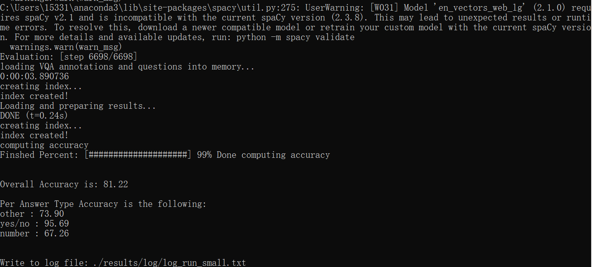

This is the README for project 2.

Enviroment Setup:

1.Python >= 3.5
2.Cuda >= 9.0 & cuDNN
3.Pytorch >= 0.4.1
4.Spacy and GloVe

The training process of MCAN-vqa is:

```bash
$ python3 run.py --RUN='train'
```

If using Windows system, use the following command:
```bash
$ python run.py --RUN='train'
```

The checkpoint can be checked in ckpts/ckpt_<VERSION>/epoch<EPOCH_NUMBER>.pkl

If you want to check the effect of specific model on validation set, use the following command:

```bash
$ python3 run.py --RUN='val' --CKPT_V=str --CKPT_E=int
```

The example model command and effect is shown below:

```bash
$ python3 run.py --RUN='val' --CKPT='small' --CKPT_E=13
```



The development process record can be checked in Development_process_record.docx

The original paper:

```
@inProceedings{yu2019mcan,
  author = {Yu, Zhou and Yu, Jun and Cui, Yuhao and Tao, Dacheng and Tian, Qi},
  title = {Deep Modular Co-Attention Networks for Visual Question Answering},
  booktitle = {Proceedings of the IEEE Conference on Computer Vision and Pattern Recognition (CVPR)},
  pages = {6281--6290},
  year = {2019}
}
```
